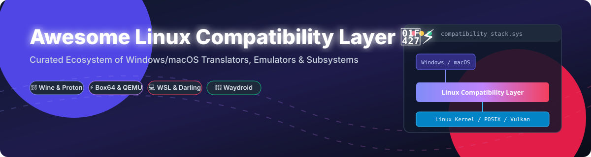

# 🐧⚡ Awesome Linux Compatibility Layer

  
  
  
  
  

## 🚀 Top Linux Compatibility Layer Ecosystem

**Curated List of Platforms, Translators & Open-Source GitHub Projects**

*Focused on Running Foreign Binaries, Windows/macOS Apps on Linux, DXVK/VKD3D Translation, Cross-Architecture Emulation & Subsystem Compatibility*

**Last updated: October 2026**

---

### 📌 Overview & Introduction

This repository tracks notable **SaaS platforms**, **API translation frameworks**, and **open-source projects** for **Linux Compatibility Layers**. These solutions enable running software built for other operating systems (Windows, macOS, Android) or different CPU architectures (x86, x86_64, ARM64, RISC-V) on Linux—or running Linux natively on Windows hosts—through binary translation, syscall reimplementation, containerization, or lightweight userspace emulation without full VM overhead.

**Popular compatibility tools** include [Proton](https://github.com/ValveSoftware/Proton), [Wine](https://github.com/wine-mirror/wine), [DXVK](https://github.com/doitsujin/dxvk), [QEMU](https://github.com/qemu/qemu), [Box64](https://github.com/ptitSeb/box64), [Waydroid](https://github.com/waydroid/waydroid), [Darling](https://github.com/darlinghq/darling), [Heroic Games Launcher](https://github.com/Heroic-Games-Launcher/HeroicGamesLauncher), [Bottles](https://github.com/bottlesdevs/Bottles), and [Windows Subsystem for Linux (WSL)](https://learn.microsoft.com/windows/wsl/).

Contributions are welcome! Please feel free to open a Pull Request to add or update entries.

---

## 📑 Table of Contents

- [☁️ SaaS / Hosted & Managed Platforms](#️-saas--hosted--managed-platforms)
- [📦 Open-Source GitHub Projects](#-open-source-github-projects)
- [🛠️ Additional Compatibility Solutions](#️-additional-compatibility-solutions)
- [🤝 How to Contribute](#-how-to-contribute)
- [☕ Support & Sponsorship](#-support--sponsorship)
- [⭐ Star History](#-star-history)
- [⚠️ Disclaimer](#️-disclaimer)

---

## ☁️ SaaS / Hosted & Managed Platforms

*(Adapted for compatibility layers: Commercial support packages, cloud container services, and vendor-integrated environments)*

**Market Size & Fragmentation Analysis:** The Linux compatibility layer and software translation market is a critical enabling ecosystem estimated to drive tens of billions of dollars in enterprise cloud workloads and Linux desktop gaming (e.g., Valve Steam Deck). The sector is **highly fragmented**, split between community-driven open-source translation projects (Wine, Box64) and enterprise/vendor platform wrappers (Microsoft WSL, Valve Steam Play, Canonical Anbox Cloud).

| Platform / Vendor | Vendor / Organization | Company Size (Valuation / Revenue) | Starting Price | Free Tier Limit | Description |
| :--- | :--- | :--- | :--- | :--- | :--- |
| 🪟 **[Windows Subsystem for Linux (WSL)](https://learn.microsoft.com/windows/wsl/)** / **[VS Code Remote WSL](https://code.visualstudio.com/docs/remote/wsl)** | Microsoft | ~$3.84 Trillion Valuation (~$245B Annual Rev) | Free with Windows / $10/mo for GitHub Copilot / Pro integrations | Unlimited full native access included with Windows 10/11 license | Microsoft’s native compatibility subsystem allowing genuine Linux distributions and ELF binaries to run on Windows, with deep VS Code integration. |
| 🎮 **[Steam Play / Proton](https://github.com/ValveSoftware/Proton)** | Valve Corporation | ~$10 Billion+ Valuation (~$13B–$16B Est. Annual Rev) | Free with Steam | Unlimited free use of Proton runtime via Steam client | Valve’s gaming-focused compatibility layer based on Wine, DXVK, and VKD3D-Proton to execute Windows games on Linux. |
| 📱 **[Anbox Cloud](https://anbox-cloud.io/)** | Canonical | ~$345 Million Revenue (Private) | $25/machine/year (Ubuntu Pro Workstation) or $500/machine/year (Server) | Free for up to 5 personal machines (Ubuntu Pro Personal) | Commercial cloud platform for running Android applications in containerized Linux environments at scale. |
| 🍷 **[CrossOver / Commercial Wine Support](https://www.codeweavers.com/)** | CodeWeavers | ~$10M–$25M Estimated Revenue (Private) | $64.00/year (12-month license & support) | 14-day fully functional free trial | Enterprise and consumer compatibility distribution with polished GUI management and technical support for running Windows apps on Linux. |

---

## 📦 Open-Source GitHub Projects

*(Sorted by GitHub Star Count in descending order)*

- 🎮 **[Proton](https://github.com/ValveSoftware/Proton)**   
  Valve’s open-source gaming compatibility tool built on Wine, DXVK, and VKD3D-Proton, optimized for running Windows games seamlessly on Linux.

- ⚡ **[DXVK](https://github.com/doitsujin/dxvk)**   
  Vulkan-based translation layer for Direct3D 8/9/10/11, allowing 3D Windows applications and games to run on Linux via Wine with high graphics performance.

- 🍺 **[Proton-GE Custom](https://github.com/GloriousEggroll/proton-ge-custom)**   
  Community-curated build of Valve's Proton with bleeding-edge Wine patches, extra video codecs, and game fixes.

- 🖥️ **[QEMU](https://github.com/qemu/qemu)**   
  Generic and open-source machine emulator and virtualizer capable of running OS binaries across cross-CPU architectures via user-mode and system-mode emulation.

- 🍎 **[Darling](https://github.com/darlinghq/darling)**   
  Open-source Darwin / macOS compatibility layer that aims to execute macOS ELF/Mach-O binaries natively on Linux by reimplementing Apple frameworks and kernel interfaces.

- 📱 **[Waydroid](https://github.com/waydroid/waydroid)**   
  Container-based approach for running full Android system instances on modern Linux desktops using LXC and Wayland.

- 🧙‍♂️ **[Heroic Games Launcher](https://github.com/Heroic-Games-Launcher/HeroicGamesLauncher)**   
  Native open-source games launcher for Linux, macOS, and Windows that manages Epic Games, GOG, and Prime Gaming titles using Wine and Proton.

- 🧪 **[Bottles](https://github.com/bottlesdevs/Bottles)**   
  Easily manage Wine prefixes, environments, and compatibility dependencies for Windows software and gaming on Linux.

- 🕹️ **[Lutris](https://github.com/Lutris/lutris)**   
  Open-source gaming platform for Linux that installs and configures games using Wine, Proton, emulators, and native runners.

- 🚀 **[FEX-Emu](https://github.com/FEX-Emu/FEX)**   
  Fast x86 and x86_64 emulator for ARM64 Linux hosts, enabling x86 games and applications to run on modern ARM platforms.

- 📦 **[Box64](https://github.com/ptitSeb/box64)**   
  High-performance userspace x86_64 Linux binary emulator tailored for ARM64 and RISC-V devices with native library wrapping.

- 🍷 **[Wine](https://github.com/wine-mirror/wine)**   
  The foundational open-source compatibility layer translating Windows API calls into POSIX calls, enabling Windows software to run on Linux and POSIX OSes.

- 🕹️ **[Box86](https://github.com/ptitSeb/box86)**   
  Linux 32-bit x86 emulator for 32-bit ARM devices (Raspberry Pi, SBCs) with hardware acceleration wrapping.

- 🔮 **[VKD3D-Proton](https://github.com/HansKristian-Work/vkd3d-proton)**   
  Fork of VKD3D aiming to implement the full Direct3D 12 API on top of Vulkan for Wine and Proton compatibility.

- 💻 **[Cygwin](https://github.com/cygwin/cygwin)**   
  Classic open-source POSIX API emulation layer and toolset providing a Linux-like environment on Microsoft Windows.

- 🔧 **[MSYS2](https://github.com/msys2/msys2-autobuild)**   
  Software distribution and building platform for Windows based on Cygwin and Pacman for building native software.

---

## 🛠️ Additional Compatibility Solutions

- **Wine + Proton-GE**: The standard combination for running Windows software and high-budget PC games on Linux desktops and handhelds.
- **Box64 & FEX-Emu**: Execute x86_64 software and Steam games seamlessly on ARM64 Linux hardware (e.g. Raspberry Pi 5, Asahi Linux on Apple Silicon).
- **Waydroid & Anbox**: Modern LXC-driven solution to run Android apps natively under Wayland.
- **Darling**: Ongoing open-source effort to translate macOS Cocoa/Mach-O binaries directly for Linux kernel execution.

---

## 🤝 How to Contribute

1. 🍴 Fork the repository.
2. 📝 Add your recommended tool or compatibility framework to `README.md`.
3. 🔗 Include the project name, star count badge, GitHub link, and a concise 1–2 sentence description.
4. 📬 Submit a Pull Request!

---

## ☕ Support & Sponsorship

Thank you for exploring and using this curated list! If you find this resource helpful for your Linux workflow, development, or gaming setup, please consider supporting the project:

- ⭐ **Star** this repository to increase visibility!
- 🔀 **Fork** and share it with fellow Linux developers and gaming enthusiasts!
- 💖 **Sponsor / Buy a Coffee**: Support ongoing open-source curation and development on the [GitHub Sponsor Dashboard](https://github.com/sponsors/ishandutta2007).

---

## ⭐ Star History

---

## ⚠️ Disclaimer

- This is a **community-curated** list for educational and technical reference.
- Compatibility layers do not guarantee 100% application functionality. Anti-cheat systems, kernel DRM, and non-standard APIs may affect performance.
- Third-party trademarks (Windows, macOS, Steam, Proton, Wine) belong to their respective owners.

---

  <b>Made with ❤️ for Linux users, cross-platform developers, and open-source enthusiasts.</b>

